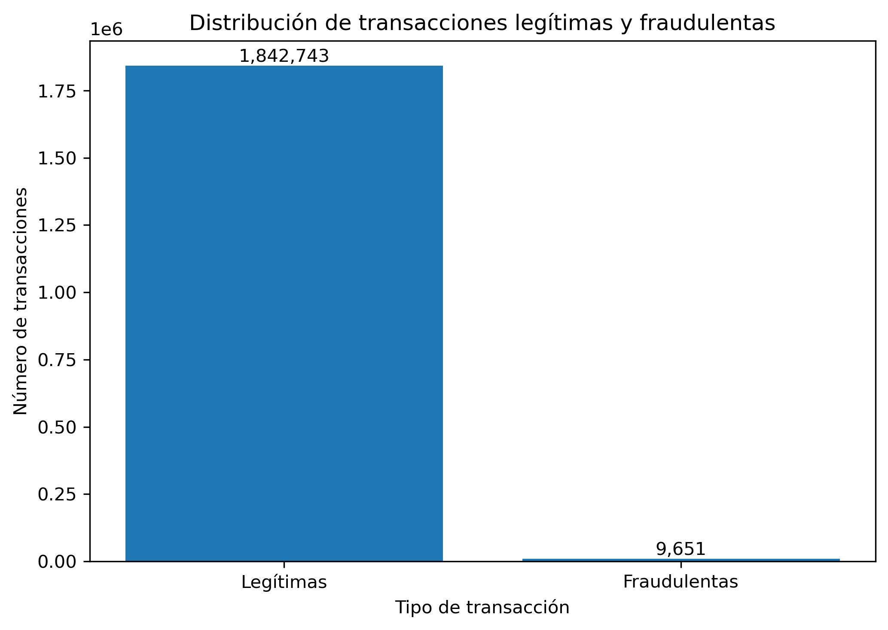
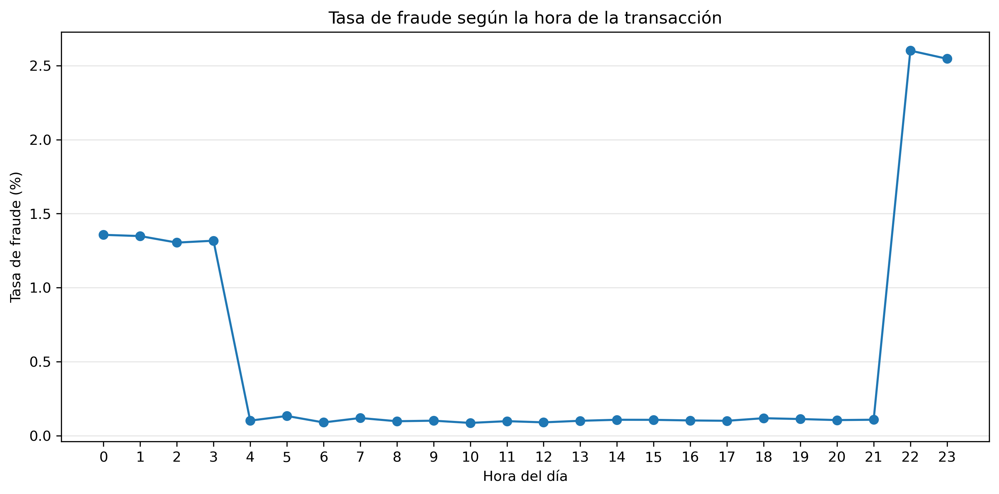
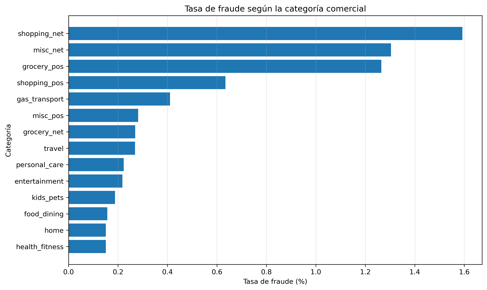
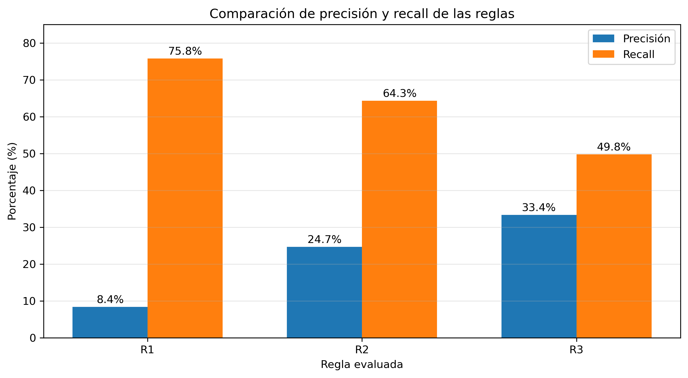

# Análisis de patrones transaccionales para el diseño y evaluación de reglas de detección de fraude en pagos electrónicos

## Proyecto Midterm – Ciencia de Datos

## Descripción del proyecto

Este proyecto analiza de manera exploratoria los patrones presentes en transacciones con tarjetas de crédito, con el propósito de identificar características asociadas con operaciones fraudulentas y comprender su comportamiento dentro del conjunto de datos. Los patrones identificados se utilizan posteriormente como base para formular y evaluar reglas exploratorias de detección de fraude.
El proceso comprende la adquisición, integración, limpieza, transformación, análisis exploratorio y visualización de los datos. A partir de los hallazgos obtenidos durante el EDA, se formulan reglas basadas en monto, horario y categoría comercial, cuyo desempeño se evalúa mediante métricas como precisión, recall, F1-Score y tasa de falsos positivos.
## Objetivo

Explorar los datos transaccionales para identificar patrones asociados con operaciones fraudulentas y analizar cómo los hallazgos obtenidos mediante el EDA pueden orientar la formulación de reglas exploratorias de detección de fraude.

## Fuente de datos

Se utiliza el **Credit Card Transactions Fraud Detection Dataset**, publicado en Kaggle por Kartik Shenoy.

Fuente:
https://www.kaggle.com/datasets/kartik2112/fraud-detection

Los archivos originales utilizados son:

- `fraudTrain.csv`
- `fraudTest.csv`

Debido a su tamaño, estos archivos no se almacenan en el repositorio. Para reproducir el análisis deben descargarse desde la fuente original y colocarse en la misma carpeta que el notebook.

## Características del conjunto de datos

Después de integrar los conjuntos de entrenamiento y prueba se obtuvieron:

- **1.852.394 transacciones**
- **1.842.743 transacciones legítimas**
- **9.651 transacciones fraudulentas**
- **Tasa global de fraude: 0,521 %**
- **Período analizado: 2019–2020**

El conjunto presenta un fuerte desbalance de clases, debido a que las operaciones fraudulentas representan una proporción reducida del total.

## Metodología

El proyecto se desarrolló mediante las siguientes etapas:

1. Adquisición y carga de los datos.
2. Inspección de variables y tipos de datos.
3. Verificación de valores nulos y registros duplicados.
4. Integración de los conjuntos `fraudTrain` y `fraudTest`.
5. Eliminación de variables de índice no necesarias.
6. Conversión de variables de fecha.
7. Generación de variables temporales.
8. Análisis exploratorio de patrones de fraude.
9. Análisis del monto, horario y categoría comercial.
10. Diseño de reglas exploratorias de detección.
11. Evaluación mediante matriz de confusión y métricas de clasificación.
12. Generación de visualizaciones.
13. Almacenamiento y consultas mediante SQLite.
14. Exportación del conjunto de datos procesado.

## Principales patrones identificados

El análisis exploratorio permitió identificar diferencias relevantes entre las operaciones legítimas y fraudulentas.

El monto promedio de las transacciones fraudulentas fue de **USD 530,66**, mientras que en las transacciones legítimas fue de **USD 67,65**.

También se observó una mayor tasa relativa de fraude durante las horas nocturnas, principalmente entre las **22:00 y las 03:59**.

Las categorías con mayores tasas de fraude observadas fueron `shopping_net`, `misc_net` y `grocery_pos`.

## Visualizaciones

### Distribución de transacciones legítimas y fraudulentas



La distribución evidencia el fuerte desbalance del conjunto de datos: las transacciones fraudulentas representan únicamente el 0,521 % del total.

### Tasa de fraude según la hora de la transacción



Se observa un incremento considerable de la tasa de fraude durante las últimas horas del día y las primeras horas de la madrugada, especialmente entre las 22:00 y las 03:59.

### Tasa de fraude según la categoría comercial



Las categorías `shopping_net`, `misc_net` y `grocery_pos` presentan las mayores tasas relativas de fraude dentro del conjunto analizado.

## Diseño de reglas exploratorias

A partir de los patrones identificados se evaluaron tres reglas:

**R1 – Monto**

- Monto >= USD 200.

**R2 – Monto + horario**

- Monto >= USD 200.
- Horario entre 22:00 y 03:59.

**R3 – Monto + horario + categoría**

- Monto >= USD 200.
- Horario entre 22:00 y 03:59.
- Categorías comerciales seleccionadas a partir de las mayores tasas de fraude observadas.

## Evaluación de las reglas

| Regla | Precisión | Recall | F1-Score | Tasa FP |
|---|---:|---:|---:|---:|
| R1 | 8,38 % | 75,80 % | 15,09 % | 4,34 % |
| R2 | 24,70 % | 64,29 % | 35,69 % | 1,03 % |
| R3 | 33,38 % | 49,77 % | 39,96 % | 0,52 % |

### Comparación gráfica



Los resultados muestran un intercambio entre cobertura y precisión. R1 detecta una mayor proporción de los fraudes, pero genera más falsos positivos. Al incorporar nuevas condiciones en R2 y R3 aumenta la precisión y disminuye la tasa de falsos positivos, aunque también se reduce el recall.

Por esta razón, las reglas deben analizarse mediante varias métricas y no únicamente por la cantidad de fraudes detectados.

## Almacenamiento en SQLite

El conjunto de datos procesado también fue almacenado en una base de datos SQLite denominada:

`fraude_transacciones.db`

Se realizaron consultas SQL para verificar el número de registros y obtener estadísticas agregadas según el indicador de fraude.

Debido a su tamaño, la base de datos no se incluye en el repositorio y puede ser generada nuevamente mediante la ejecución del notebook.

## Estructura del repositorio

```text
Proyecto-Fraude-Midterm/
│
├── Proyecto_Fraude_Midterm.ipynb
├── README.md
├── .gitignore
├── descripcion_dataset.txt
│
├── distribucion_fraude.png
├── tasa_fraude_por_hora.png
├── tasa_fraude_por_categoria.png
└── comparacion_reglas_precision_recall.png
